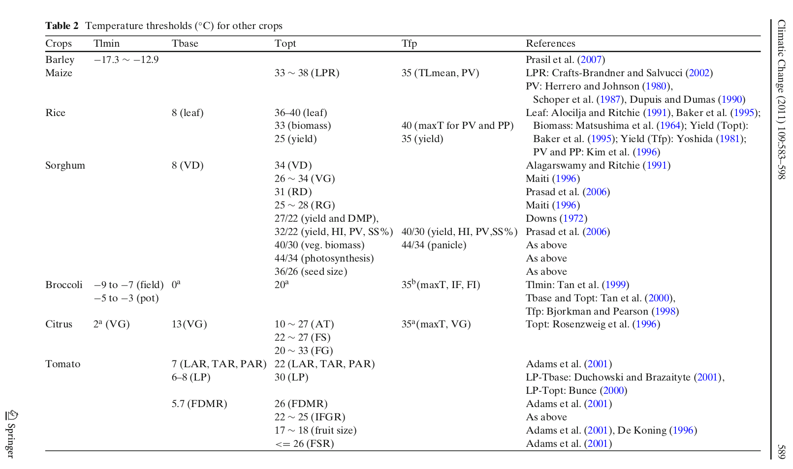
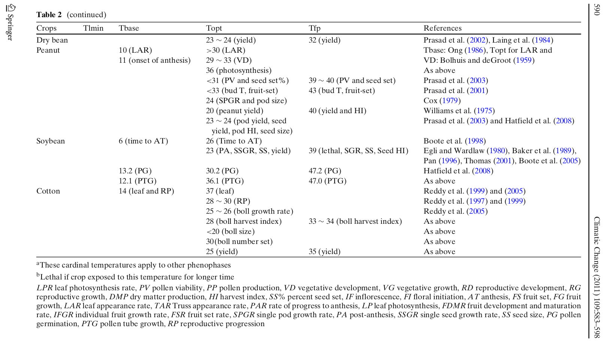

```{r setup, include=FALSE}
knitr::opts_chunk$set(echo = TRUE)
```


```{r, results='hide', message=FALSE, warning=FALSE, include=FALSE}
library(forecast)
library(prophet)
library(ggplot2)
library(scales)
library(urca)
library(tsfeatures)
library(tidyverse)
#library(ForecastComb)
library(imputeTS)
#library(GGally)
library(gridExtra)
library(PerformanceAnalytics)
library(plotly)

freq.daily <- 48
route  = "./MODELS/"
route_proc = "../../DATA/DATA_UMU/PROC/"
ts.daily <- paste(route_proc, "ts.daily.rds", sep="") %>%  readRDS()
ts.daily.broken <- paste(route_proc, "ts.daily.broken.rds", sep="") %>%  readRDS()


pleiadesGH.v0 <- paste(route_proc, "pleiadesGH.v0.rds", sep="") %>%  readRDS()
pleiadesGH.v0.interp <- paste(route_proc, "pleiadesGH.v0.interp.rds", sep="") %>%  readRDS()

pleiadesGH.v1 <- paste(route_proc, "pleiadesGH.v1.rds", sep="") %>%  readRDS()
pleiadesGH.v1.interp <- paste(route_proc, "pleiadesGH.v1.interp.rds", sep="") %>%  readRDS()

pleiadesGH.v2 <- paste(route_proc, "pleiadesGH.v2.rds", sep="") %>%  readRDS()
pleiadesGH.v2.interp <- paste(route_proc, "pleiadesGH.v2.interp.rds", sep="") %>%  readRDS()

f <- paste(route_proc, "f.rds", sep="") %>%  readRDS()
fx <- paste(route_proc, "fx.rds", sep="") %>%  readRDS()

trainedModelsList <- paste(route, "trainedModelsList.rds", sep="") %>%  readRDS()
forecastsLists    <- paste(route, "forecastsLists.rds", sep="") %>%  readRDS()

sets    <- paste(route, "sets.rds", sep="") %>%  readRDS()
pred    <- "tempInt"
```


Aqui se discute la seleccion de un cultivo para generar alarmas por temperaturas letales en el paper de invernaderos 4.0.

```{r, echo=FALSE, fig.align="center"}
start = f %>%  start
end = f %>% end

f %>% window(start = start,
             end = end) -> g

autoplot(g[,"REAL"], series = "REAL",  color = "black")+
  theme_bw()+
  theme(legend.position = "bottom") +
  labs(y = "ºC", x = "DOY", color = element_blank())+
  guides(col = guide_legend(nrow = 1))+
  ggtitle("TEMPERATURA INTERIOR INVERNADERO PLEIADES")
```


En el articulo propuesto por Alfonso se muestran las siguientes tablas de temperaturas:



_Temperature thresholds and crop production: a review_, Qunying Luo Climatic Change (2011) 109:583–598, DOI 10.1007/s10584-011-0028-6

Recordemos que el invernadero esta notablemente más caliente que el exterior durante todo el año, tal y como se muestra en la tabla las temperaturas mínimas de los cultivos estan en el rango [-17ºC, -3ºC] y la temperatura mas fría registrada por el invernadero es de 8ºC aprox. Por lo tanto las alarmas por temperatura mínima estan descartadas. 


<center>


</center>


Me parece interesante el caso del brocoli puesto que es un vegetal que se cultiva durante todo el año, su _temperature failure point (tfp)_ y temperatura maxima letal son razonablemente altas para dar "juego" con las alarmas por exceso de calor. Concretamente el _tfp_ 35 ºC aprox. en la tabla anterior.


Lo siguientes parrafos han sido extraidos de otro articulo cientifico, que justifican un poco la decision del brocoli:

_[Broccoli] It is grown for both the fresh vegetable
market and the processed food industry. The shelf-life of broccoli is
short, excised florets spoiling within 2–3 days at room temperature
(Paulsen et al., 2018). Thus, __broccoli crops are produced throughout the
year__ and are, therefore, grown under a wide range of environmental
conditions (Wurr et al., 1991, 1995; Olesen, 1998; Tan et al., 2000a;
Lindemann-Zutz et al., 2016ab) [...]  Broccoli crops are scheduled to meet consumer demand for both
fresh vegetables and frozen foods. It is a continuous challenge for
growers to meet the immediate demand for broccoli due to the un-
predictability of crop development and head growth, but any inability
to schedule crops appropriately presents a considerable financial risk
(Lindemann-Zutz et al., 2016b)._

[...]

_The development of a broccoli plant consists of six phases: a germination phase,
an emergence phase, a juvenile phase, a vegetative
phase, a budding phase, and a heading phase (Huth et al., 2009). The
vegetative phase is also referred to as the head induction phase and the
budding and heading phases combined are referred to as the head
growth phase. The head induction phase culminates in the phenological
stage of head initiation and the beginning of the head growth phase.
Broccoli has been reported to have a facultative (optional) vernalization
response and head initiation can be observed even when grown at
temperatures as high as 24−26 °C (Lindemann-Zutz et al., 2016a, and
references therein). The juvenile phase, during which temperature has
little effect on vernalization, is completed when plants have 3–5 leaves,
which is the size at which broccoli plants are commonly transplanted to
the field (Lindemann-Zutz et al., 2016a, and references therein). The
optimum vernalisation temperature, defined as the temperature at
which the intiation of heading is most rapid, is about 15−20 °C for
most broccoli cultivars (Wurr et al., 1995; Fellows et al., 1997; Grevsen,
1998, 2000; Grevsen and Olesen, 1999; Lindemann-Zutz et al., 2016a).
Plants require a longer thermal time, expressed as °C d, to head in-
itiation if exposed to cooler or warmer temperatures than the optimum
during growth and __no head initiation is expected at temperatures below
0 °C or above 25–30 °C__ _


_Predicting dates of head initiation and yields of broccoli crops grown
throughout Scotland_, Davide Cammarano et al, European Journal of Agronomy 116 (2020) 12605, https://doi.org/10.1016/j.eja.2020.126055


Por todo lo explicado anteriormente he decido utilizar como __threshold__ la temperatura de 35ºC (para ir en coherencia con las tablas).


```{r, include=FALSE}
# añadido 28/07/2020
tresh.max = 35 #LIMITE
```


```{r, include=FALSE}
for (i in 1:length(forecastsLists)){
  mean <- forecastsLists[[i]]$PROPHET.fcast
  forecastsLists[[i]]$PROPHET.fcast <- list()
  forecastsLists[[i]]$PROPHET.fcast$mean <- mean
    
  mean <- forecastsLists[[i]]$MEAN.fcast
  forecastsLists[[i]]$MEAN.fcast <- list()
  forecastsLists[[i]]$MEAN.fcast$mean <- mean
}
```

# TEMPERATURA MÁXIMA LETAL

Recordemos que estamos tratando el caso de alarma semanal. Se lanza una alarma en una semana si la temperatura predicha ha superado el umbral maximo durante un tiempo mayor o igual a 1 hora. 
.

```{r, cache=TRUE, include=FALSE}
# --------------- EXPERIMENTAL2020

t = 2 # 1 hour 
listaConfusionSemanalTotal <- list()

for (model in (forecastsLists[[1]] %>% names)){
  print(model)
  listaConfusionSemanal <- list()
  j = 1
  for (error in seq(-40,+40,0.1)){
    for(i in seq(1,length(sets),1)){ # realiza calculos para cada una de las semanas
              TP = 0
              TN = 0
              FP = 0
              FN = 0
          
              # Me quedo con los valores reales (REAL) y los predecidos(PRED)
              cbind(REAL = sets[[i]]$TEST[,pred] %>% as.numeric(),
                    PRED = forecastsLists[[i]][[model]]$mean)  %>% as.data.frame() -> dfAlerts
              
              # Calculo los valores de alarma booleanos, tanto REALES como PRED
              dfAlerts$ALARM.REAL <- dfAlerts$REAL > tresh.max
              dfAlerts$ALARM.PRED <- dfAlerts$PRED + error > tresh.max
          
              #Comprobar si hay TP en real [tuplas > t]
              which(dfAlerts$ALARM.REAL == T) -> index
              if (length(index) == 0) {
                # no nay ninguna observacion que haya superado el umbral, directamente sabemos q la alarma nunca pudo saltar
                REAL = FALSE 
              } else {
                # hay observaciones que han superado el umbral, comprobamos que fue durante t observaciones consecutivas
                  csum<-cumsum(c(1, abs(index[-length(index)] - index[-1]) > 1))
                  by(index, csum, identity) -> listaIndicesAlertasMax
                  (Filter(function(x) length(x) >= t, listaIndicesAlertasMax)  %>%  length()) > 0 -> REAL
              }
              
              #Comprobar si hay P en pred [tuplas > t]
              which(dfAlerts$ALARM.PRED == T) -> index
              if (length(index) == 0) {
                PRED = FALSE
              } else {
                  csum<-cumsum(c(1, abs(index[-length(index)] - index[-1]) > 1))
                  by(index, csum, identity) -> listaIndicesAlertasMax
                  (Filter(function(x) length(x) >= t, listaIndicesAlertasMax)  %>%  length()) > 0 -> PRED
              }
          
              
              if (REAL & PRED) {
                TP = 1
              }else if (!REAL & !PRED) {
                TN= 1
              }else if (REAL & !PRED) {
                FN = 1
              }else if (!REAL & PRED) {
                FP = 1
              }
              
              listaConfusionSemanal[[toString(i)]] <- list(TP = TP,
                                                           TN = TN,
                                                           FN = FN,
                                                           FP = FP)
          }
          
          cbind(TP = sapply(listaConfusionSemanal, '[[', "TP"),
                TN = sapply(listaConfusionSemanal, '[[', "TN"),
                FP = sapply(listaConfusionSemanal, '[[', "FP"),
                FN = sapply(listaConfusionSemanal, '[[', "FN")) %>% as.data.frame() -> resultsWeekly
          
          
          
          TPR = (resultsWeekly$TP %>% sum()) / (resultsWeekly$TP %>% sum()
                                                +
                                                resultsWeekly$FN %>% sum())
          
          TNR = (resultsWeekly$TN %>% sum()) / (resultsWeekly$FP %>% sum()
                                                +
                                                resultsWeekly$TN%>% sum())
  
          FPR = 1 - TNR
          FNR = 1 - TPR
          listaConfusionSemanalTotal[[model]][[toString(j)]] <- list(TPR = TPR, FPR = FPR)
          j = j + 1 
          
  }
}
```


```{r, include=FALSE}
for (model in listaConfusionSemanalTotal %>% names()) {
  cbind(TPR = sapply(listaConfusionSemanalTotal[[model]], '[[', "TPR"),
        FPR = sapply(listaConfusionSemanalTotal[[model]], '[[', "FPR")) %>% as.data.frame() -> listaConfusionSemanalTotal[[model]]
}
```


```{r, include=FALSE}
cbind(listaConfusionSemanalTotal$SNAIVE.fcast,seq(-40,+40,0.1)) -> fusion
fusion
#fusion[fusion$TPR==1 & fusion$FPR < 1,]
```


```{r,echo=FALSE}

p1 <- ggplot() +
  geom_line(aes(x = listaConfusionSemanalTotal$NNETAR$FPR, y = listaConfusionSemanalTotal$NNETAR$TPR, color = "NNETAR"))+
  geom_line(aes(x = listaConfusionSemanalTotal$TBATS.fcast$FPR, y = listaConfusionSemanalTotal$TBATS.fcast$TPR, color = "TBATS"))+
  geom_line(aes(x = listaConfusionSemanalTotal$ARIMA$FPR, y = listaConfusionSemanalTotal$ARIMA$TPR, color = "ARIMA"))+
  geom_line(aes(x = listaConfusionSemanalTotal$MEAN.fcast$FPR, y = listaConfusionSemanalTotal$MEAN.fcast$TPR, color = "COMB"))+
  geom_line(aes(x = listaConfusionSemanalTotal$SNAIVE$FPR, y = listaConfusionSemanalTotal$SNAIVE$TPR, color = "SNAIVE"))+
  geom_line(aes(x = listaConfusionSemanalTotal$PROPHET$FPR, y = listaConfusionSemanalTotal$PROPHET$TPR, color = "PROPHET"))+


  geom_point(aes(x = listaConfusionSemanalTotal$NNETAR$FPR, y = listaConfusionSemanalTotal$NNETAR$TPR, color = "NNETAR"))+
  geom_point(aes(x = listaConfusionSemanalTotal$TBATS.fcast$FPR, y = listaConfusionSemanalTotal$TBATS.fcast$TPR, color = "TBATS"))+
  geom_point(aes(x = listaConfusionSemanalTotal$ARIMA$FPR, y = listaConfusionSemanalTotal$ARIMA$TPR, color = "ARIMA"))+
  geom_point(aes(x = listaConfusionSemanalTotal$MEAN.fcast$FPR, y = listaConfusionSemanalTotal$MEAN.fcast$TPR, color = "COMB"))+
  geom_point(aes(x = listaConfusionSemanalTotal$SNAIVE$FPR, y = listaConfusionSemanalTotal$SNAIVE$TPR, color = "SNAIVE"))+
  geom_point(aes(x = listaConfusionSemanalTotal$PROPHET$FPR, y = listaConfusionSemanalTotal$PROPHET$TPR, color = "PROPHET"))+
  guides(colour = guide_legend(override.aes = list(size=1))) + 
  geom_point(aes(x = 0, y = 0.90476190, color = "PROPHET"), size = 5)+  
  geom_point(aes(x = 0.7142857,  y = 1, color = "SNAIVE"), size = 5)+  

  theme_bw()+
  ggtitle("ROC curves for non-informed scenario")+
  labs(x = "FPR", y = "TPR", color = element_blank()) +
  ggsave("ROCnonInf.jpeg",
       dpi = 600,
       height = 6*2,
       width = 8*2,
       units = "cm",
       path = "./exportsPleiades")

#ggplotly(p1)

p1
```


Una opción podría ser el valor de $\epsilon$ que genera el punto marcando con un aspa azul (SNAIVE, $\epsilon = 4.0$). 


```{r, include=FALSE}
## EXPERIMENTAL 2020 
error = 10.4 # SNAIVE
metrics <- list()
for (model in (forecastsLists[[1]] %>% names)){
  for(i in seq(1,length(sets),1)){ # realiza calculos para cada una de las semanas
              TP = 0
              TN = 0
              FP = 0
              FN = 0
          
              # Me quedo con los valores reales (REAL) y los predecidos(PRED)
              cbind(REAL = sets[[i]]$TEST[,pred] %>% as.numeric(),
                    PRED = forecastsLists[[i]][[model]]$mean %>%  as.numeric())  %>% as.data.frame() -> dfAlerts
              
              # Calculo los valores de alarma booleanos, tanto REALES como PRED
              dfAlerts$ALARM.REAL <- dfAlerts$REAL > tresh.max
              dfAlerts$ALARM.PRED <- dfAlerts$PRED + error> tresh.max
          
              #Comprobar si hay TP en real [tuplas > t]
              which(dfAlerts$ALARM.REAL == T) -> index
              if (length(index) == 0) {
                REAL = FALSE
              } else {
                  csum<-cumsum(c(1, abs(index[-length(index)] - index[-1]) > 1))
                  by(index, csum, identity) -> listaIndicesAlertasMax
                  Filter(function(x) length(x) >= t, listaIndicesAlertasMax)  %>%  length() > 0 -> REAL
              }
              
              #Comprobar si hay P en pred [tuplas > t]
              which(dfAlerts$ALARM.PRED == T) -> index
              if (length(index) == 0) {
                PRED = FALSE
              } else {
                  csum<-cumsum(c(1, abs(index[-length(index)] - index[-1]) > 1))
                  by(index, csum, identity) -> listaIndicesAlertasMax
                  Filter(function(x) length(x) >= t, listaIndicesAlertasMax)  %>%  length() > 0 -> PRED
              }
          
              
              if (REAL & PRED) {
                TP = 1
              }else if (!REAL & !PRED) {
                TN= 1
              }else if (REAL & !PRED) {
                FN = 1
              }else if (!REAL & PRED) {
                FP = 1
              }
              
              listaConfusionSemanal[[toString(i)]] <- list(TP = TP,
                                                         TN = TN,
                                                         FN = FN,
                                                         FP = FP)
          }
          
          cbind(TP = sapply(listaConfusionSemanal, '[[', "TP"),
                TN = sapply(listaConfusionSemanal, '[[', "TN"),
                FP = sapply(listaConfusionSemanal, '[[', "FP"),
                FN = sapply(listaConfusionSemanal, '[[', "FN")) %>% as.data.frame() -> resultsWeekly
          
          
          
          TPR = (resultsWeekly$TP %>% sum()) / (resultsWeekly$TP %>% sum()
                                                +
                                                resultsWeekly$FN %>% sum())
          
          TNR = (resultsWeekly$TN %>% sum()) / (resultsWeekly$FP %>% sum()
                                                +
                                                resultsWeekly$TN%>% sum())
  
          FPR = 1 - TNR   
          
          FNR = 1 - TPR
          
          ACC = (resultsWeekly$TP %>% sum() + resultsWeekly$TN %>% sum()) / 
                (resultsWeekly$TP %>% sum() +
                 resultsWeekly$TN %>% sum() +
                 resultsWeekly$FP %>% sum() + 
                 resultsWeekly$FN %>% sum())
          
          metrics[[model]] <- list(TPR = TPR, TNR = TNR, FNR = FNR, FPR = FPR, ACC = ACC)
}
```


```{r, include=FALSE}
metrics$SNAIVE.fcast
```


  |           | NO ALARM | ALARM |  
  | :-------: | :----: | :----: |
  | **NO ALARM**| TNR =  1  | FPR = 0
  | **ALARM**   | FNR =  0.09  | TPR = 0.90
  
$$  ACC = 0.92 $$

 
```{r}
start = f %>%  start
end = f %>% end

f %>% window(start = start,
             end = end) -> g

autoplot(g[,"PROPHET"] + 4.5, series = "PROPHET")+
  autolayer(g[,"REAL"], series = "REAL",  color = "black", alpha = 0.5) +
  geom_hline(aes(yintercept = 35))+

  theme_bw()+
  theme(legend.position = "bottom") +
  labs(y = "?C", color = element_blank())+
  guides(col = guide_legend(nrow = 1))+
  ggtitle("PROPHET + 4.5 ºC")
```
 
 
 
 
 
```{r, include=FALSE}
# SOBRE LAS SITUACIONES QUER GENERAN UNA MATRIZ DE CONFUSION CON NaN en el False Positive Rate (FPR)
# Definición de FPR: 
#       FPR = 1 - TNR
#       TNR = (TN)/(TN + FP)

# Cuando FPR es NaN entonces: 
#       FPR = 1 - NaN
#       TNR = (0)/(0+0)
#
#Es decir que TN = 0,  FP = 0 Y TP = 1, por lo tanto  FN = 0

# Para que esta situacion se de en absolutamente TODAS las semanas debe de haber un un intervalo t que supere el umbral Y que la prediccion tambien supere el umbral,
# teniendo como resultado que SIEMPRE que PRED y REAL sea TRUE. ----> La primera condicion (y la segunda) se cumplen perfectamente para thresholds pequeños, pues la temperatura del invernader es muy alta para TODAS las semanas.
# Cuando mas bajo sea el umbral, mas facil será que esta situación tan particular se de.
# Cuando el umbral sea lo suficientemente alto, entonces existiran situaciones en las que las alarmas REAL y PRED sean distintas y eso hara que TP != 1 y FN > 0. teniendo como 
# resultado que el valor de FPR sea numerico [0,1] y no NaN


# Para que ocurriera un TN tendría que ocurrir lo siguiente:
#    1. Que en la serie de tiempo real no hubiese ninguna "meseta" de valores superando el threshold. Esto es MUY dificil que ocurra cuando la meseta (t) es pequeña.
#    2  Que en la serie de tiempo predicha de igual forma no exista ningun valor que supere el threshold en ninguna meseta > t, esto es muy dificil pues las predicciones son inestables y es facil q se disparen, 
#        superando el threshold con facilidad.
```


